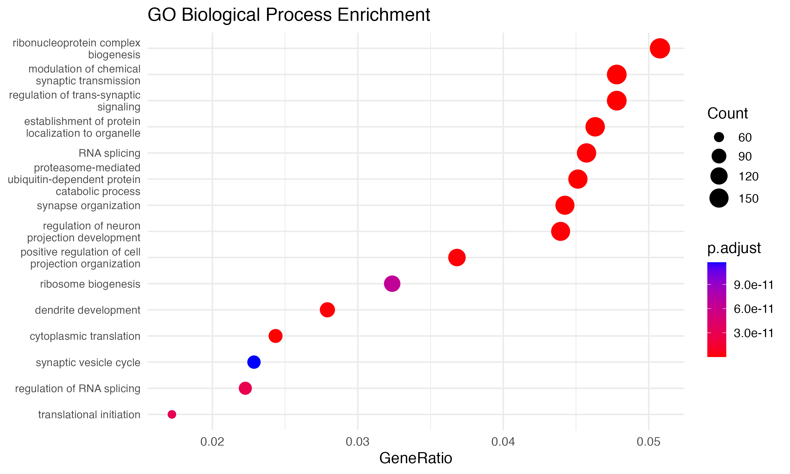
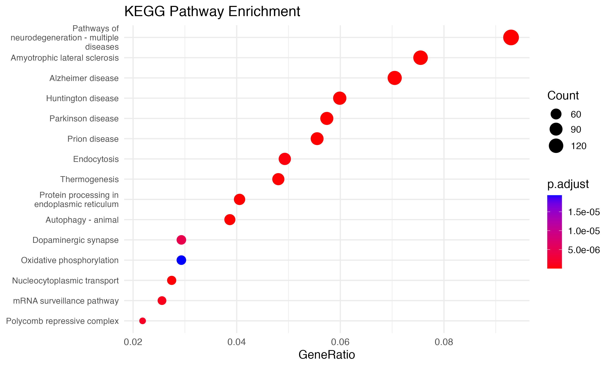
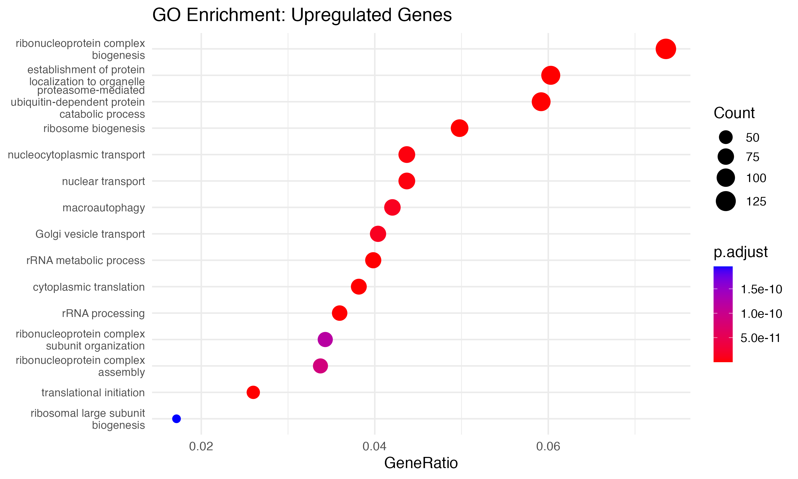
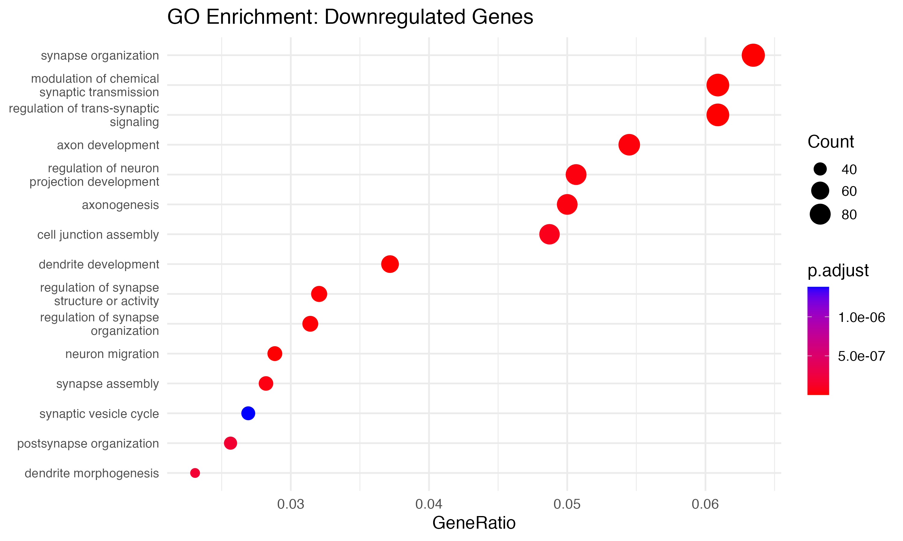

# SARSCoV2-Dopamine-scRNA
A modular pipeline for single-cell RNA-seq analysis of SARS-CoV-2-induced gene expression changes in human dopaminergic neurons, featuring Seurat-based clustering, differential expression analysis, and gene ontology enrichment.

## Summary
1. Import of raw expression matrix and quality control using Seurat
2. Normalization, scaling, and clustering of neuronal populations
3. Differential expression analysis (infected vs. mock)
4. Functional enrichment of differentially expressed genes (GO/KEGG)
5. Visualization of enriched pathways

## Project Structure
```
sarscov2-dopamine-scRNA/
├── scripts/                            # R scripts, executed sequentially
│   ├── 01_import_qc.R                  # (1)  Load data, perform initial QC and filtering
│   ├── 02_normalization_clustering.R   # (2)  Normalize, scale, and cluster cells using Seurat
│   ├── 03_differential_expression.R    # (3)  Identify DEGs between infected and mock cells
│   ├── 04_enrichment_analysis.R        # (4)  Perform GO/KEGG enrichment with clusterProfiler
│   ├── 05_enrichment_dotplots.R        # (5)  Generate dotplots for enriched pathways
│   ├── 06_go_enrichment_by_direction.R # (6)  Separate GO terms by up/downregulated DEGs  
│   └── 07_plot_go_dotplots.R           # (7)  Create dotplots highlighting GO categories
│
├── data/
│   └── sample_metadata.csv             # CSV file linking each sample to its condition (infected/mock)
│
├── results/                            # All output files from analysis
│   ├── figures/                        # Visual outputs
│   │   ├── umap_clusters.png               # UMAP of cell clusters
│   │   ├── pca_elbow_plot.pdf              # PCA elbow plot for dimensionality reduction
│   │   ├── volcano_degs.png                # Volcano plot of differentially expressed genes
│   │   ├── dotplot_go_bp.png               # Dotplot: GO Biological Processes
│   │   ├── dotplot_go_upregulated.png      # Dotplot: GO terms for upregulated DEGs
│   │   ├── dotplot_go_downregulated.png    # Dotplot: GO terms for downregulated DEGs
│   │   └── dotplot_kegg.png                # Dotplot: KEGG pathways
│   │
│   └── tables/                         # Tabular outputs
│       ├── degs_infected_vs_mock.csv       # Differential expression results
│       ├── go_enrichment.csv               # All GO term enrichment results
│       ├── go_up.csv                       # GO terms enriched in upregulated genes
│       ├── go_down.csv                     # GO terms enriched in downregulated genes
│       ├── kegg_enrichment.csv             # KEGG pathway enrichment results
│       └── unmapped_genes.csv              # Genes excluded from enrichment due to annotation issues
│
├── environment.yml                     # Defines Conda environment with R, Seurat, and dependencies
├── .gitignore                          # Excludes unnecessary or large files from Git tracking
└── README.md                           # Project overview, instructions, and structure description

```
## Installation

1. Clone the repository:
```bash
git clone https://github.com/lladney/SARSCoV2-Dopamine-scRNA.git
cd SARSCoV2-Dopamine-scRNA
```  

2. Create a Conda environment:
```bash
conda env create -f environment.yml
conda activate seurat_env
```

## Running the Pipeline

### Step 1:  *IMPORT AND QUALITY CONTROL*
Go to the scripts/ directory and run: 
```bash 
Rscript scripts/01_import_qc.R
```
This will: 
- Import the expression matrix
- Filter low-quality cells and genes
- Perform initial UMAP and PCA visualization

Outputs:
1) 
2) 📄 [View PCA Elbow Plot (PDF)](results/figures/pca_elbow_plot.pdf)


### Step 2:  *NORMALIZATION AND CLUSTERING*
Go to the scripts/ directory and run:
```bash
Rscript 02_normalization_clustering.R
```
This will: 
- Normalize and scale the data
- Identify variable features
- Perform PCA, clustering, and UMAP dimensionality reduction

Outputs:
1) Updates 

### Step 3:  *DIFFERENTIAL EXPRESSION ANALYSIS*
Go to the scripts/ directory and run:
```bash
Rscript 03_differential_expression.R
```	
This will: 
- Compare infected vs. mock-treated cells

Outputs:
1) ` degs_infected_vs_mock.csv `
2) 

### Step 4:  *GO AND KEGG ENRICHMENT ANALYSIS*
Go to the scripts/ directory and run:
```bash
Rscript 04_enrichment_analysis.R
```	
This will: 
- Use clusterProfiler to identify enriched GO terms and KEGG pathways

Outputs:
1) ` results/tables/go_enrichment.csv `
2) ` results/tables/kegg_enrichment.csv `

### Step 5:  *PLOT ENRICHMENT RESULTS*
Go to the scripts/ directory and run:
```bash
Rscript 05_enrichment_dotplots.R
```	
This will: 
- Generate dotplots for enriched pathways

Outputs:
1) 
2) 

### Step 6:  *GO ENRICHMENT BY DIRECTION*
Go to the scripts/ directory and run:
```bash
Rscript 06_go_enrichment_by_direction.R
```	
This will: 
- Separate enrichment results for upregulated vs. downregulated genes

Outputs:
1) ` results/tables/go_up.csv `
2) ` results/tables/go_down.csv `

### Step 7:  *VISUALIZE GO TERMS*
Go to the scripts/ directory and run:
```bash
Rscript 07_plot_go_dotplots.R
```	
This will: 
- Generate directional dotplots for biological process GO terms

Outputs:
1) 
2) 

## Dataset

This project uses single-cell RNA-seq data from [GSE248989](https://www.ncbi.nlm.nih.gov/geo/query/acc.cgi?acc=GSE248989), profiling pluripotent human stem cell–derived dopaminergic neurons infected with SARS-CoV-2.

- **Title:** SARS-CoV-2 Infection Causes Dopaminergic Neuron Senescence
- **GEO Accession:** GSE248989  
- **Organism:** Homo sapiens  
- **Conditions:** SARS-CoV-2–infected vs. mock-treated neurons  
- **Rationale:** Selected for its relevance to neurological dysfunction and COVID-19, the dataset contains high-quality 10X scRNA-seq suitable for infection-induced transcriptomic changes through clustering, differential expression, and functional enrichment analyses.

### Citation

**PubMed (APA format):**

Yang, L., Kim, T. W., Han, Y., Nair, M. S., Harschnitz, O., Zhu, J., et al. (2024). *SARS-CoV-2 infection causes dopaminergic neuron senescence*. *Cell Stem Cell, 31*(2), 196–211.e6. https://doi.org/10.1016/j.stem.2023.12.012

## Notes
* Raw FASTQ files and intermediate large data are excluded via ```.gitignore```
* This pipeline was developed and tested on macOS 10.15 with Conda and R 4.3+
* Analysis is fully reproducible using the provided scripts and ```environment.yml```
* Processed expression and metadata files derived from GSE248989 GEO submission 


